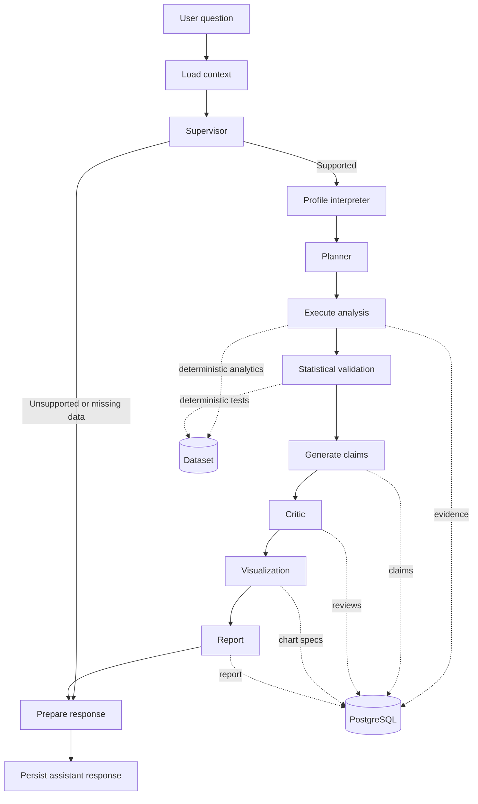
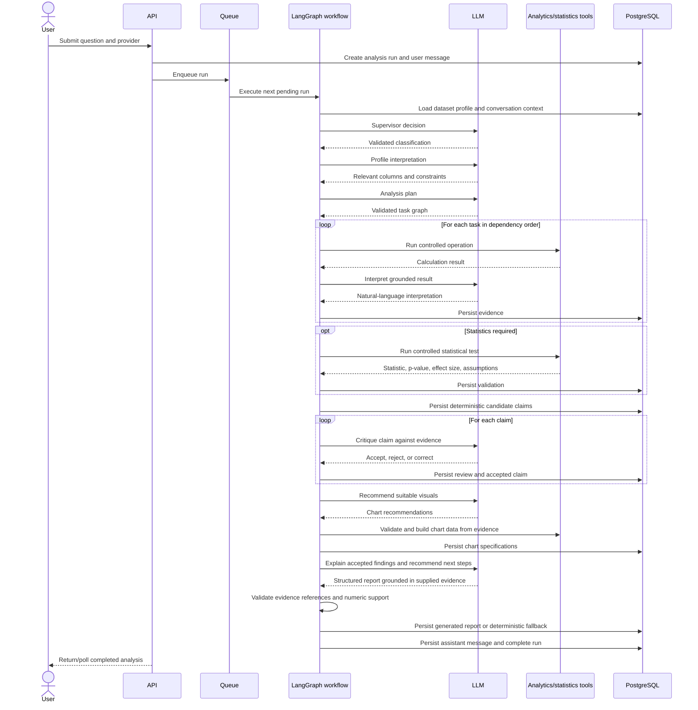
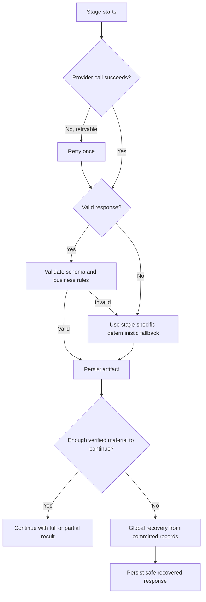

# Tatparya Agent Orchestration

> Interactive companion: [`docs/architecture/tatparya-agent-flow.html`](docs/architecture/tatparya-agent-flow.html). The editable workflow source and validation artifact are kept beside it in `docs/architecture/`.

This document explains how Tatparya turns a natural-language business question into calculations, evidence, findings, visuals, and a report. It covers the active execution path, the contract between stages, failure recovery, observability, and the quality metrics that can be reported honestly.

> The examples below are simplified illustrations. Exact values and wording depend on the selected dataset and provider response.

## 1. Architecture at a glance

Tatparya uses a **state-driven, sequential LangGraph workflow**. Agents do not send free-form messages directly to one another. Each stage:

1. reads named fields from a shared `AnalysisState`;
2. produces a validated output;
3. persists important artifacts to PostgreSQL;
4. writes its result back to the shared state; and
5. passes control to the next stage.

This design separates probabilistic reasoning from deterministic computation. The LLM helps interpret intent, plan work, review claims, and recommend presentation. The backend owns calculations, schema validation, evidence references, persistence, and recovery.



The normal supported route is:

```text
START
  -> load_context
  -> supervisor
  -> profile_interpreter
  -> planner
  -> execute_analysis
  -> statistical_validation
  -> generate_claims
  -> critic
  -> visualization
  -> report
  -> prepare_response
  -> END
```

The unsupported route is intentionally shorter:

```text
START -> load_context -> supervisor -> prepare_response -> END
```

## 2. What is an agent in this system?

The word *agent* is used for a component that has a narrow responsibility and a defined input/output contract. Not every workflow stage is an LLM call.

| Stage | Active implementation | Nature | Main responsibility |
|---|---|---|---|
| Load context | Backend service | Deterministic | Load the run, dataset profile, query, and conversation context |
| Supervisor | `SupervisorAgent` | LLM + schema validation | Classify the request and decide whether available data can answer it |
| Profile interpreter | `ProfileInterpreterAgent` | LLM + schema validation | Identify relevant columns, roles, exclusions, and data constraints |
| Planner | `PlannerAgent` | LLM + strict plan validation | Decompose the question into an ordered task graph |
| Execute analysis | `AnalystAgent` per task | Hybrid | Select a safe operation, run deterministic analytics, and describe the result |
| Statistical validation | `StatisticalValidatorAgent` per eligible task | Hybrid | Run an appropriate deterministic statistical test and interpret it |
| Generate claims | Fallback claim generator | Deterministic | Convert saved evidence into grounded candidate findings |
| Critic | `CriticAgent` per claim | LLM + deterministic checks | Accept, reject, or correct claims against evidence |
| Visualization | `VisualizationAgent` | LLM recommendation + deterministic builder | Recommend charts; validate and build chart data from evidence |
| Report | `ReportAgent` with fallback report builder | LLM + evidence validation, deterministic fallback | Explain accepted findings and generate specific next steps; recover from generation failures |
| Prepare response | Backend formatter | Deterministic | Produce and persist the user-facing assistant message |

One agent class exists in the codebase but is **not part of the active production path**:

- `ClaimGeneratorAgent`: available for an LLM-generated claim flow, while the active workflow currently uses deterministic evidence-derived claims.

The active report stage calls `ReportAgent` using accepted claims and their supporting evidence. Its structured output is validated before persistence. The deterministic report builder is used when generation or validation fails, or when there are no accepted claims to ground a model-generated report.

## 3. Shared state and stage contracts

The workflow state is defined in `app/graph/state.py`. It contains identifiers, request context, intermediate outputs, and error information:

```text
analysis_run_id, user_id, dataset_id, conversation_id,
user_query, llm_provider, dataset_profile, conversation_context,
supervisor_decision, profile_interpretation, analysis_plan,
evidence, statistical_validations, claims, claim_reviews,
accepted_claims, chart_specs, final_report,
current_node, assistant_message, error_code, error_message
```

The producer/consumer relationships are explicit:

| Stage | Reads | Produces |
|---|---|---|
| `load_context` | run identifiers | `user_query`, `dataset_profile`, `conversation_context` |
| `supervisor` | query, profile, conversation | `supervisor_decision` |
| `profile_interpreter` | query, profile, supervisor decision | `profile_interpretation` |
| `planner` | query, profile, decision, interpretation | `analysis_plan` |
| `execute_analysis` | plan, profile | `evidence` |
| `statistical_validation` | plan, profile, evidence | `statistical_validations` |
| `generate_claims` | evidence | `claims` |
| `critic` | claims, evidence, statistics, profile | `claim_reviews`, `accepted_claims` |
| `visualization` | accepted claims, evidence, profile | `chart_specs` |
| `report` | accepted claims, evidence, statistics, profile | `final_report` |
| `prepare_response` | decision, report, evidence, statistics, plan | `assistant_message` |

Because every handoff uses named fields, a downstream stage does not need to understand the internal prompt or implementation of the upstream stage. It only needs to understand the contract.

## 4. End-to-end interaction sequence



## 5. Stage-by-stage inputs and outputs

The shared example throughout this section is:

> **Question:** “Analyze revenue performance across regions and months, identify the strongest and weakest areas, and provide supporting visuals.”

Assume the profiled dataset contains:

```text
Date, Region, Product, Revenue, Units_Sold,
Marketing_Spend, Discount_Percent
```

### 5.1 Load context

**Input**

- `analysis_run_id`
- persisted user message
- selected dataset identifier
- authenticated user identifier

**Work performed**

- verifies that the run and dataset belong to the user;
- loads the saved dataset profile rather than asking the LLM to inspect a raw file;
- loads recent conversation context;
- resolves the selected provider saved on the run.

**Output**

```json
{
  "user_query": "Analyze revenue performance across regions and months...",
  "llm_provider": "gemini",
  "dataset_profile": {
    "row_count": 31,
    "columns": ["Date", "Region", "Product", "Revenue", "Units_Sold", "Marketing_Spend", "Discount_Percent"]
  },
  "conversation_context": []
}
```

### 5.2 Supervisor

**Input**

- user query;
- dataset schema/profile;
- recent conversation context.

**Purpose**

The supervisor performs routing, not calculation. It decides what kind of question was asked, which metrics and dimensions are relevant, whether statistics or visuals are requested, and whether the dataset can support the request.

**Validated output model**

- `query_type`: descriptive, diagnostic, comparative, statistical, predictive, data quality, or unsupported;
- `objective`;
- `target_metrics`;
- `relevant_dimensions`;
- `requires_statistics`;
- `requires_visualization`;
- `can_answer_with_available_data`;
- `missing_requirements`.

**Example output**

```json
{
  "query_type": "comparative",
  "objective": "Compare revenue by region and month and identify the strongest and weakest performers.",
  "target_metrics": ["Revenue"],
  "relevant_dimensions": ["Region", "Date"],
  "requires_statistics": false,
  "requires_visualization": true,
  "can_answer_with_available_data": true,
  "missing_requirements": []
}
```

If a user asks for competitor pricing but the dataset has no competitor or pricing data, this stage returns `can_answer_with_available_data: false`. The graph then skips analysis and prepares a useful explanation of what is missing.

### 5.3 Profile interpreter

**Input**

- user query;
- dataset profile;
- supervisor decision.

**Purpose**

The profile interpreter maps business language to actual columns. It labels columns by role, detects usable date fields, records data-quality constraints, and excludes identifiers or irrelevant fields.

**Example output**

```json
{
  "relevant_columns": [
    {
      "name": "Revenue",
      "role": "metric",
      "inferred_type": "numeric",
      "relevance_reason": "The requested performance measure."
    },
    {
      "name": "Region",
      "role": "dimension",
      "inferred_type": "categorical",
      "relevance_reason": "Required for regional comparison."
    },
    {
      "name": "Date",
      "role": "date",
      "inferred_type": "datetime",
      "relevance_reason": "Required for monthly aggregation."
    }
  ],
  "usable_date_columns": ["Date"],
  "data_quality_constraints": ["Revenue contains unusually large values that should be retained and disclosed."],
  "excluded_columns": ["Product", "Units_Sold", "Marketing_Spend", "Discount_Percent"],
  "analysis_warnings": []
}
```

All returned column names are checked against the real dataset schema. An invented column is rejected.

### 5.4 Planner

**Input**

- question and objective;
- supervisor decision;
- interpreted dataset profile.

**Purpose**

The planner converts one broad question into small, independently verifiable tasks. A task declares its required columns, method, priority, and dependencies.

**Example output**

```json
{
  "question_type": "comparative",
  "objective": "Compare revenue by region and month.",
  "target_metric": "Revenue",
  "analysis_strategy": "Aggregate revenue independently by region and by calendar month, rank the results, then present both views.",
  "requires_statistics": false,
  "requires_visualization": true,
  "tasks": [
    {
      "task_code": "TASK_001",
      "objective": "Calculate total revenue for each region.",
      "analysis_type": "aggregation",
      "required_columns": ["Region", "Revenue"],
      "method": "Group by Region and sum Revenue in descending order.",
      "priority": 1,
      "depends_on": []
    },
    {
      "task_code": "TASK_002",
      "objective": "Calculate monthly revenue totals.",
      "analysis_type": "time_series",
      "required_columns": ["Date", "Revenue"],
      "method": "Aggregate Revenue by calendar month in ascending date order.",
      "priority": 2,
      "depends_on": []
    }
  ],
  "completion_criteria": [
    "Regional totals are calculated and ranked.",
    "Monthly totals are calculated in chronological order.",
    "Findings reference saved evidence."
  ],
  "limitations": []
}
```

The backend rejects plans that contain unknown columns, duplicate task codes, missing dependencies, self-dependencies, circular dependencies, invalid types, or more than the allowed number of tasks. Tasks are then executed in dependency-safe order.

### 5.5 Analyst and controlled analytics

**Input per task**

- one validated planned task;
- actual dataset schema and profile;
- sanitized dataset file;
- evidence from completed dependencies, when applicable.

**Purpose**

The analyst stage does not permit arbitrary generated Python or SQL. It chooses from a controlled operation set and executes calculations through backend tools.

Supported operations are:

- `groupby_aggregate`;
- `filter_dataset`;
- `calculate_percentage_change`;
- `calculate_contribution`;
- `calculate_correlation`;
- `distribution_summary`;
- `time_series_aggregate`.

Pandas and DuckDB perform the calculations. The current active implementation derives a safe request from the validated task and columns. The LLM is used to explain the returned result, not to invent calculation output.

**Example tool request for `TASK_001`**

```json
{
  "tool": "groupby_aggregate",
  "parameters": {
    "group_by": ["Region"],
    "metric": "Revenue",
    "aggregation": "sum",
    "sort": "descending"
  },
  "interpretation_focus": "Identify the strongest and weakest regions by total revenue."
}
```

**Example evidence output**

```json
{
  "evidence_code": "TASK_001_E1",
  "task_code": "TASK_001",
  "operation": "groupby_aggregate",
  "columns_used": ["Region", "Revenue"],
  "results": [
    {"Region": "North", "Revenue": 1581500.0},
    {"Region": "West", "Revenue": 420000.0},
    {"Region": "South", "Revenue": 306500.0},
    {"Region": "East", "Revenue": 288000.0}
  ],
  "interpretation": "North has the highest recorded revenue, while East has the lowest in this dataset.",
  "warnings": []
}
```

`TASK_002` might produce:

```json
{
  "evidence_code": "TASK_002_E1",
  "task_code": "TASK_002",
  "operation": "time_series_aggregate",
  "columns_used": ["Date", "Revenue"],
  "results": [
    {"Date": "2026-01", "Revenue": 411500.0},
    {"Date": "2026-02", "Revenue": 484000.0},
    {"Date": "2026-03", "Revenue": 1700500.0}
  ],
  "interpretation": "March has the highest monthly revenue in the observed period.",
  "warnings": []
}
```

Before accepting an LLM interpretation, the backend checks that numeric values mentioned in the text exist in the tool result. If the interpretation fails or introduces unsupported numbers, a deterministic explanation is used instead.

### 5.6 Statistical validator

**Input**

- eligible task;
- dataset profile;
- completed evidence;
- relevant columns.

**Purpose**

This stage runs only where statistical validation is relevant. It selects a test from the data types and question:

| Data shape | Possible method |
|---|---|
| Two numeric variables | Pearson or Spearman correlation |
| One categorical and one numeric variable, two groups | Welch t-test or Mann–Whitney U |
| One categorical and one numeric variable, more than two groups | ANOVA |
| Two categorical variables | Chi-square |

**Example output**

```json
{
  "task_code": "TASK_003",
  "method_used": "pearson",
  "statistic": 0.82,
  "p_value": 0.003,
  "effect_size": 0.82,
  "confidence_interval": [0.45, 0.95],
  "assumptions": ["Paired numeric observations were available."],
  "is_significant": true,
  "is_valid": true,
  "warnings": ["Correlation does not establish causation."]
}
```

The statistic, p-value, effect size, confidence interval, assumptions, and validity are produced by controlled statistical code. The LLM may explain them, but cannot replace those computed values.

### 5.7 Claim generation

**Input**

- persisted evidence records.

**Purpose**

The active workflow derives candidate claims deterministically from evidence. Every claim includes one or more evidence codes, creating an auditable link from user-facing language back to a saved calculation.

**Example output**

```json
[
  {
    "claim_code": "C1",
    "claim_text": "North generated the highest total revenue at 1,581,500.",
    "claim_type": "descriptive",
    "evidence_codes": ["TASK_001_E1"]
  },
  {
    "claim_code": "C2",
    "claim_text": "East generated the lowest total revenue at 288,000.",
    "claim_type": "comparative",
    "evidence_codes": ["TASK_001_E1"]
  },
  {
    "claim_code": "C3",
    "claim_text": "March was the strongest observed month with revenue of 1,700,500.",
    "claim_type": "descriptive",
    "evidence_codes": ["TASK_002_E1"]
  }
]
```

### 5.8 Critic

**Input per claim**

- candidate claim;
- referenced evidence;
- statistical validations;
- dataset profile and warnings.

**Purpose**

The critic checks whether wording is supported, whether the evidence is strong enough, whether statistical language is appropriate, and whether a correction is required. Deterministic checks also reject missing evidence references, unsupported numbers, and causal language not justified by the analysis.

**Example output**

```json
{
  "claim_code": "C1",
  "status": "accepted",
  "evidence_strength": "strong",
  "issues": [],
  "missing_analysis": [],
  "corrected_wording": null
}
```

A claim can have one of three statuses:

- `accepted`: supported as written;
- `rejected`: not supported and excluded from the report;
- `needs_more_evidence`: not safe to present as a verified finding.

### 5.9 Visualization

**Input**

- accepted claims;
- saved evidence;
- dataset profile.

**Purpose**

The visualization agent recommends a chart type and field mapping. The backend then validates the recommendation and constructs the chart values from saved evidence. The LLM does not supply the plotted numbers.

Supported chart types include line, bar, horizontal bar, grouped bar, stacked bar, scatter, histogram, box plot, pie, donut, heatmap, and waterfall.

**Example recommendation**

```json
{
  "needed": true,
  "chart_type": "bar",
  "title": "Revenue by Region",
  "x_column": "Region",
  "y_column": "Revenue",
  "group_column": null,
  "evidence_codes": ["TASK_001_E1"],
  "purpose": "Compare regional revenue totals."
}
```

**Example persisted chart specification**

```json
{
  "chart_type": "bar",
  "title": "Revenue by Region",
  "x_key": "Region",
  "y_keys": ["Revenue"],
  "data": [
    {"Region": "North", "Revenue": 1581500.0},
    {"Region": "West", "Revenue": 420000.0},
    {"Region": "South", "Revenue": 306500.0},
    {"Region": "East", "Revenue": 288000.0}
  ],
  "evidence_codes": ["TASK_001_E1"]
}
```

Chart recommendations are rejected if they use unknown columns, unknown evidence, unsupported types, or unusable result shapes. Duplicate chart signatures are removed, and a run is limited to four chart specifications.

### 5.10 Report

**Input**

- accepted claims;
- evidence;
- statistical validations;
- dataset-quality warnings.

**Purpose**

The active report path asks the selected LLM provider to turn accepted findings and their saved evidence into:

- executive summary;
- key findings with evidence references;
- statistical findings when available;
- business recommendations;
- necessary data notes and limitations retained in the saved report schema.

Each recommendation connects an action to an observed finding and explains what to check or measure afterward. The backend checks the report schema, accepted claim/evidence references, and numeric grounding. A finding's numbers must be supported by its own linked evidence. Empty findings are rejected when accepted claims are available. Model failure or invalid output triggers the deterministic report fallback; report persistence failure goes to global recovery without retrying the write. The frontend and PDF preserve each recommendation as one complete item.

**Example output**

```json
{
  "executive_summary": "Revenue is concentrated in the North region, and March is the strongest month in the observed period.",
  "key_findings": [
    {
      "claim_code": "C1",
      "finding": "North generated the highest total revenue at 1,581,500.",
      "evidence_codes": ["TASK_001_E1"]
    },
    {
      "claim_code": "C3",
      "finding": "March was the strongest observed month with revenue of 1,700,500.",
      "evidence_codes": ["TASK_002_E1"]
    }
  ],
  "statistical_findings": [],
  "recommendations": [
    "Review the products and channels behind North's performance before applying the same approach elsewhere.",
    "Compare March's sales mix with January and February to identify repeatable drivers."
  ],
  "data_notes": [],
  "limitations": ["The result describes the available records and does not establish causes."]
}
```

### 5.11 Prepare response

**Input**

- supervisor decision;
- final report when available;
- plan, evidence, and statistics for safe fallbacks.

**Output**

- a persisted assistant message;
- final run status;
- response returned to the frontend through the run/message APIs.

This stage also produces a helpful response for unsupported requests. It states what the dataset can answer and which missing fields would be needed, rather than returning a generic provider error.

## 6. Failure handling and fallback strategy

Tatparya has layered recovery. A failure is handled as close as possible to where it occurs, and the workflow falls back to already verified artifacts rather than inventing an answer.



### 6.1 Provider-level retry

Each LLM call has at most **two total attempts**: the initial attempt plus one retry for retryable failures such as:

- invalid structured response;
- timeout;
- rate limit;
- temporary provider unavailability;
- provider execution failure.

For invalid structured output, the retry includes a correction instruction. Authentication and other non-retryable errors are not repeatedly sent.

The provider saved for the run remains the provider used for that run. The current implementation does **not** silently switch Gemini to Groq or Groq to Gemini.

### 6.2 Stage-specific behavior

| Failure point | Recovery behavior | User-visible outcome |
|---|---|---|
| Supervisor output invalid after retry | Global recovery uses profile/context | Safe explanation or narrower retry guidance |
| Profile interpretation invalid | Workflow recovery uses committed context | Safe partial response; no invented columns |
| Planner creates invalid columns or dependencies | Plan rejected; recovery is invoked | Dataset-aware response instead of invalid execution |
| One analysis task fails | Task marked failed; independent tasks continue | Partial but verified findings, with a warning |
| A task dependency fails | Dependent task is skipped | No calculation based on missing prerequisite evidence |
| All analysis tasks fail | Global recovery starts | Profile-based answer and retry guidance |
| Analyst interpretation fails or adds unsupported numbers | Deterministic interpretation | Calculation remains available and grounded |
| Statistical validation fails | Statistics omitted; analysis continues | Descriptive result without unsupported significance claims |
| Claim critique fails | Grounded claims accepted by deterministic fallback with moderate strength | Findings remain available with critique limitation recorded |
| Visualization recommendation fails or is invalid | Deterministic chart fallback derives suitable charts from evidence | Visuals can still be produced from completed calculations |
| Report generation or validation fails | Deterministic report assembled from accepted claims and saved evidence | Existing calculations, charts, and conservative next steps remain available |
| Final workflow exception | Re-read committed records and construct recovered report/message | Completed partial response when safe material exists |
| Database unavailable during recovery | Cannot safely persist recovery | Run may be marked failed when persistence becomes possible |

### 6.3 Partial task execution

Tasks are processed in topological dependency order. For example:

```text
TASK_001: regional aggregation       completed
TASK_002: monthly aggregation        completed
TASK_003: unsupported regression     failed
TASK_004: depends on TASK_003        skipped
```

The workflow can continue with evidence from `TASK_001` and `TASK_002`. It does not discard valid work because an unrelated task failed.

Regression is currently not executed by the controlled analysis service. If planned, it fails safely rather than running generated code.

### 6.4 Global recovery order

If an uncaught workflow error occurs, `_recover_response` rolls back unfinished transaction state, reloads committed artifacts, and uses this priority order:

1. **Saved report exists:** preserve it and append an appropriate recovery limitation.
2. **Accepted evidence-linked claims exist:** produce a findings-based partial report.
3. **Completed safe calculations exist:** summarize only approved result shapes such as group-by, time series, or distribution results, explicitly marking the result as unreviewed partial output.
4. **Only dataset profile exists:** return available row/column context and suggest a narrower retry.

Recovery never treats an incomplete model message as verified evidence.

## 7. Grounding and accuracy controls

Tatparya does not rely on a single prompt to be correct. It uses multiple controls at different layers.

### 7.1 Schema accuracy

- Pydantic models forbid unexpected fields for structured agent outputs.
- Required fields, enum values, lengths, and types are checked.
- Dataset column names are matched against the real profile.
- Plan task codes and dependencies are validated.

### 7.2 Calculation accuracy

- Calculations run through a fixed tool allowlist.
- Arbitrary model-generated Python and SQL are not executed.
- The backend builds and validates operation parameters.
- Numeric results come from Pandas/DuckDB/statistical libraries, not generated prose.

### 7.3 Evidence and claim accuracy

- Every accepted claim must reference persisted evidence codes.
- Numeric statements are checked against referenced results.
- Unsupported causal wording is rejected or corrected.
- Rejected claims are excluded from the report.
- Statistics carry assumptions and warnings alongside the result.

### 7.4 Visualization accuracy

- Chart values are derived from evidence, not from LLM-generated arrays.
- Axis fields and evidence references are validated.
- Unsupported and duplicate charts are rejected.
- A chart cannot silently introduce a calculation that was never executed.

### 7.5 Recovery accuracy

- Recovery reads committed database artifacts.
- It prefers a smaller verified answer over a larger speculative answer.
- It identifies partial or fallback output in trace metadata.

## 8. Metrics: what can be measured today

There is currently **no defensible single “agent accuracy percentage.”** The project does not yet contain a labeled benchmark set with expected answers. Production telemetry measures reliability and execution quality; it should not be presented as semantic accuracy.

### 8.1 Existing operational metrics

The monitoring and agent-run records can report:

| Metric | Definition | What it tells us |
|---|---|---|
| Run completion rate | completed terminal runs / all terminal runs | End-to-end reliability |
| Run failure rate | failed terminal runs / all terminal runs | Frequency of unrecovered failures |
| Provider failure rate | failed provider calls / provider calls | Provider/API reliability |
| Agent failure rate | failed executions / executions, grouped by agent name | Which reasoning stage is least reliable |
| Average agent latency | total stage latency / completed stage calls | Slow stages and providers |
| Average run duration | total completed-run duration / completed runs | User-perceived processing time |
| Queue depth | pending + running jobs | Current workload and waiting pressure |
| Token usage | prompt, completion, and total tokens by agent/provider | Cost and prompt-efficiency signal |
| Recent failure distribution | failures grouped by error code/stage | Most common operational problems |

Each LLM-backed execution creates an `agent_runs` record with:

- agent name, including task or claim suffix where relevant;
- provider and model;
- status;
- prompt, completion, and total token counts;
- latency;
- timestamps;
- safe error code and error message.

### 8.2 Useful derived quality metrics

These can be calculated from existing persisted artifacts and logs, or promoted to dashboard counters:

| Metric | Suggested formula |
|---|---|
| Fallback rate | runs with a fallback outcome / completed runs |
| Recovery success rate | recovered runs / runs that entered global recovery |
| Task completion coverage | completed planned tasks / all planned tasks |
| Evidence coverage | tasks with persisted evidence / executable planned tasks |
| Claim acceptance rate | accepted claims / reviewed claims |
| Claim evidence coverage | accepted claims with valid evidence links / accepted claims |
| Statistical validity rate | validations with `is_valid=true` / attempted validations |
| Visualization yield | saved non-duplicate charts / runs requiring visualization |
| Unsupported-routing rate | requests routed unsupported / all requests |
| Data-quality warning rate | runs with profile or evidence warnings / completed runs |

Claim evidence coverage should approach 100% because the backend enforces evidence references. That number demonstrates traceability, not whether a business conclusion is objectively optimal.

### 8.3 Statistical measures are not agent accuracy

The following describe a statistical result, not the quality of the agent:

- p-value;
- effect size;
- confidence interval;
- test statistic;
- assumption checks;
- correlation coefficient.

For example, a small p-value does not prove the agent is accurate, and a large correlation does not prove causation or business value.

### 8.4 Metrics needed for a true accuracy evaluation

A proper offline evaluation should use a versioned benchmark containing datasets, questions, expected operations, expected numeric outputs, and reviewed findings. Recommended metrics are:

| Evaluation area | Metric |
|---|---|
| Supervisor routing | Query-type accuracy and answerability accuracy |
| Column selection | Precision, recall, and F1 against expected relevant columns |
| Planning | Required-task coverage and invalid-task rate |
| Tool selection | Exact match or acceptable-operation match |
| Numeric result | Absolute/relative error within an agreed tolerance |
| Claim faithfulness | Supported claims / total presented claims |
| Hallucination rate | Unsupported factual or numeric claims / total claims |
| Statistical selection | Appropriate-test rate against reviewed cases |
| Chart choice | Human rubric for readability, appropriateness, and non-duplication |
| Report usefulness | Reviewed score for clarity, completeness, and actionability |
| Fallback correctness | Safe useful fallbacks / injected failure cases |

An evaluation suite should include normal cases, ambiguous wording, missing columns, empty results, invalid dates, high-cardinality categories, missing values, provider timeouts, malformed JSON, and partial database artifacts.

## 9. Observability and tracing

Tatparya exposes two complementary views.

### 9.1 Database monitoring

The application monitoring page is built from persisted runs and `agent_runs`. It is the source for statuses, failure rates, latency, token usage, queue state, and recent errors.

### 9.2 LangSmith traces

LangSmith shows the hierarchy of a request:

```text
analysis.request
└── workflow
    ├── supervisor
    │   └── provider model call
    ├── profile_interpreter
    ├── planner
    ├── analyst:TASK_001
    ├── analyst:TASK_002
    ├── critic:C1
    ├── critic:C2
    ├── visualization
    ├── report
    └── fallback/recovery span, when used
```

Handoff metadata identifies the producer stage, consumer stage, and shared state fields. By default, traces are metadata-focused so raw dataset values, prompts, and model output are not unnecessarily copied into observability tooling.

Useful trace outcomes include:

- `completed`;
- `completed_with_fallback`;
- `unsupported`;
- `partial`;
- `recovered_partial`.

## 10. Persistence and audit trail

The orchestration is recoverable because major artifacts are saved, rather than existing only inside one prompt chain:

```text
AnalysisRun
  ├── AnalysisPlan
  │   └── AnalysisTask(s)
  ├── EvidenceRecord(s)
  ├── StatisticalValidation(s)
  ├── Claim(s)
  │   └── ClaimReview(s)
  ├── ChartSpec(s)
  ├── Report
  ├── AgentRun(s)
  └── Message(s)
```

This makes it possible to answer:

- Which provider and model ran each agent?
- Which calculation supports a finding?
- Why was a claim rejected?
- Which stage failed?
- Did the response use a fallback?
- How long did each stage take?
- What verified work existed before recovery?

## 11. Queue and concurrency model

Analysis requests are placed in a database-backed queue. The active worker polls for pending work, claims a job, and executes the workflow. The current configuration uses one worker concurrency slot and is designed for a single application process.

If the process restarts, interrupted running jobs are re-queued. This is adequate for the current deployment shape, but it is not a distributed queue. Running multiple independent application replicas would require stronger job claiming/locking or an external queue such as Redis-backed workers.

## 12. Design strengths and current boundaries

### Strengths

- Clear responsibility per stage.
- Explicit state contracts instead of hidden peer-to-peer prompts.
- Deterministic calculations and statistical tests.
- Evidence-linked findings.
- Partial success when independent tasks fail.
- Deterministic fallbacks for interpretation, claims, charts, reports, and global recovery.
- Persisted audit trail and per-agent observability.
- Provider choice is saved per run for reproducibility.

### Current boundaries

- No automatic cross-provider failover.
- No single semantic accuracy score or benchmark suite yet.
- Regression execution is intentionally unsupported.
- Claim generation remains deterministic. Report generation uses the selected provider with an evidence-based fallback, so it adds an LLM call and depends on provider quality for the final narrative.
- Queue concurrency is intentionally conservative and single-process oriented.
- A complete database outage prevents persistence-based recovery.
- LLM planning can still be imperfect, although schema and column validation prevent many unsafe plans from executing.

## 13. How to describe the system concisely

Tatparya is a sequential, state-driven analysis workflow. The supervisor classifies a business question, the profile interpreter grounds it in real dataset columns, and the planner decomposes it into validated tasks. Controlled analytics and statistical tools perform the actual calculations. Results are stored as evidence, converted into evidence-linked claims, reviewed by a critic, and presented through validated charts and an LLM-generated report with evidence checks. Every major artifact is persisted, so if a model or stage fails, the system can continue with independent tasks or reconstruct a smaller, verified answer from committed evidence. Report generation has its own deterministic fallback. Operational monitoring measures completion, failures, latency, tokens, and fallback behavior; semantic accuracy requires a separate labeled benchmark rather than a single unsupported percentage.

## 14. Primary code map

| Concern | File or directory |
|---|---|
| Graph construction | `app/graph/workflow.py` |
| Topology and state contracts | `app/graph/topology.py` |
| Shared state | `app/graph/state.py` |
| Node adapters | `app/graph/nodes.py` |
| End-to-end execution and recovery | `app/services/analysis_execution_service.py` |
| Job queue | `app/services/analysis_job_queue.py` |
| Supervisor agent | `app/agents/supervisor.py` |
| Profile interpreter | `app/agents/profile_interpreter.py` |
| Planner | `app/agents/planner.py` |
| Analyst | `app/agents/analyst.py` |
| Statistical validator | `app/agents/statistical_validator.py` |
| Critic | `app/agents/critic.py` |
| Visualization agent | `app/agents/visualization.py` |
| Plan validation | `app/services/analysis_plan_service.py` |
| Task execution | `app/services/analysis_task_execution_service.py` |
| Statistical execution | `app/services/statistical_validation_service.py` |
| Claims, charts, and report assembly | `app/services/analysis_output_service.py` |
| Provider abstraction and retry | `app/services/llm/` |
| Agent execution records | `app/services/agent_run_service.py` |
| Prompts | `app/prompts/` |
| Structured contracts | `app/schemas/` |
| Analytical tools | `app/tools/` |
| Monitoring endpoints | `app/api/monitoring.py` |

When changing the workflow, update the graph topology, shared state contract, node adapter, persistence behavior, tests, and this document together. A new agent should have one narrow responsibility, a strict input/output contract, validation at its boundary, an observable execution record, and a defined failure path.
